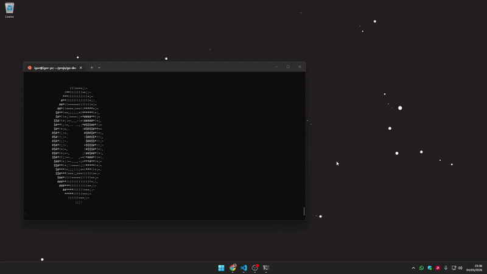

---

### Logic for Rendering the Torus (AKA Donut)

This implementation follows the mathematical principles of 3D projection and lighting to generate a spinning ASCII donut.

---

#### 1. Defining the Parametric Surface

The torus is generated by taking a circle of radius $R_1$ centered at $(R_2, 0, 0)$ and revolving it around the $y$-axis. Every point on the surface is defined by two angles: $\theta$ (the angle around the circle's cross-section) and $\phi$ (the angle of revolution).

The initial 3D coordinates $(x, y, z)$ are derived as:

$$\begin{pmatrix} x \\ y \\ z \end{pmatrix} = \begin{pmatrix} (R_2 + R_1 \cos \theta) \cos \phi \\ R_1 \sin \theta \\ -(R_2 + R_1 \cos \theta) \sin \phi \end{pmatrix}$$

#### 2. Executing 3D Rotations

To animate the donut, we rotate the object around the $x$-axis (by angle $A$) and the $z$-axis (by angle $B$). By applying rotation matrices, we calculate the new position of every point:

- **$x$ coordinate:** $(R_2 + R_1 \cos \theta)(\cos \phi \cos B + \sin A \sin \phi \sin B) - R_1 \sin \theta \cos A \sin B$
- **$y$ coordinate:** $(R_2 + R_1 \cos \theta)(\cos \phi \sin B - \sin A \sin \phi \cos B) + R_1 \sin \theta \cos A \cos B$
- **$z$ depth:** $K_2 + \cos A (R_2 + R_1 \cos \theta) \sin \phi + R_1 \sin \theta \sin A$

#### 3. Perspective Projection

To project these 3D points onto a flat 2D terminal screen, we scale the $(x, y)$ coordinates based on their distance from the viewer ($z$). We use a constant $K_1$ to represent the distance from the viewer to the screen and $K_2$ for the distance to the object:

$$x' = \text{center}_x + \frac{K_1 \cdot x}{z}, \quad y' = \text{center}_y - \frac{K_1 \cdot y}{z}$$

#### 4. Calculating Illumination (Luminance)

The "brightness" of each point is calculated by finding the dot product between the surface normal and a fixed light source. This gives us a value $L$ that represents how much light hits that specific point:

$$L = \cos \phi \cos \theta \sin B - \cos A \cos \theta \sin \phi - \sin A \sin \theta + \cos B (\cos A \sin \theta - \cos \theta \sin A \sin \phi)$$

#### 5. Character Mapping and Z-Buffering

- **ASCII Mapping:** The $L$ value (clamped between 0 and 1.4) is mapped to an index in the string `".,-~:;=!*#$@"`. Points with higher $L$ values use denser characters like `@`, while lower values use `.`.
- **Z-Buffer:** For every $(x', y')$ pixel, we maintain a 1D array to store the reciprocal of the depth ($1/z$). We only draw a character if its current $1/z$ is greater than the value already stored, ensuring that the front of the donut correctly hides the back.
